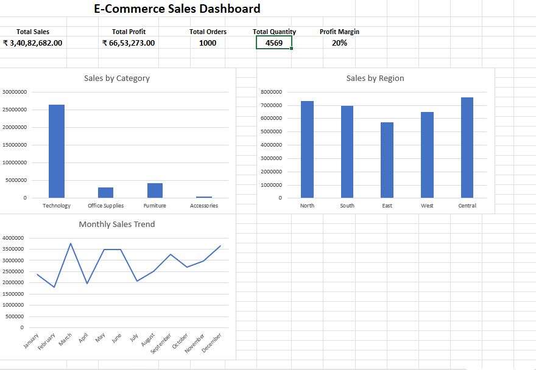

# E-Commerce Sales Analysis

## Project Overview

This project analyzes e-commerce sales data using **MySQL and Microsoft Excel** to understand sales performance, profitability, customer behavior, product performance, regional performance, and monthly sales trends.

## Tools & Technologies

- MySQL
- Microsoft Excel
- SQL
- GitHub

## Dataset

The dataset contains **1,000 e-commerce orders** with information about:

- Order details
- Customers
- Products
- Categories
- Regions
- Quantity
- Sales
- Discounts
- Profit

## Key Performance Metrics

| Metric | Value |
|---|---:|
| Total Sales | ₹3,40,82,682 |
| Total Profit | ₹66,53,273 |
| Total Orders | 1,000 |
| Total Quantity | 4,569 |
| Profit Margin | 20% |

## Analysis Performed

### SQL Analysis

- Data quality checks
- NULL value checks
- Duplicate record checks
- Sales and profit analysis
- Category analysis
- Product analysis
- Regional analysis
- Customer analysis
- Monthly sales trends
- Product ranking
- Month-over-month sales analysis
- Discount analysis
- High-value order analysis

### Excel Dashboard

The Excel dashboard includes:

- KPI summary
- Sales by Category
- Sales by Region
- Monthly Sales Trend

## Dashboard

## Project Files

- `ecommerce_sales_1000_rows (1).csv` — Dataset
- `ecommerce_analysis.sql` — SQL analysis queries
- `ecommerce_sales_dashboard.xlsx` — Excel dashboard
- `dashboard.png` — Dashboard screenshot

## Key Skills Demonstrated

- SQL data analysis
- Data cleaning and validation
- Aggregation and filtering
- Window functions
- Excel formulas
- Data visualization
- Dashboard creation
- Business-oriented data analysis
- GitHub project documentation

## Conclusion

This project demonstrates an end-to-end data analysis workflow, from raw e-commerce data and SQL analysis to an interactive Excel dashboard and documented GitHub portfolio project.
